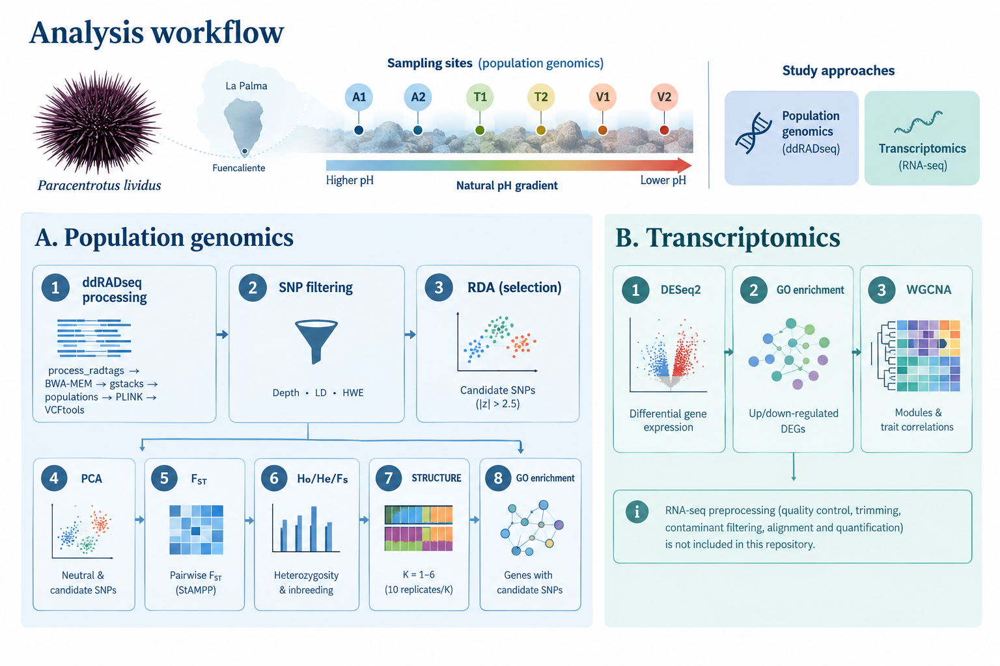

# *Paracentrotus lividus* population genomics and transcriptomics

Reproducible population genomic and transcriptomic analyses supporting:

> Fernández-Vilert, R., Arranz, V., Martín-Huete, M., Oleksiak, M. F., Crawford, D. L., González-Delgado, S., Hernández, J. C., & Pérez-Portela, R. **Natural pH gradients uncover genomic and transcriptomic bases of ocean acidification adaptation in the marine calcifier *Paracentrotus lividus*.**

## Overview

This repository contains the analytical workflows used to investigate genomic and transcriptomic responses to ocean acidification in the sea urchin *Paracentrotus lividus* at the natural CO₂ vent system of Fuencaliente, La Palma (Canary Islands, Spain).

The study combines population genomics and transcriptomics to investigate signatures of adaptation and gene expression responses across a natural pH gradient.

The analyses are divided into two main components:

1. **Population genomics**, using ddRADseq data to investigate population structure and identify candidate SNPs associated with pH variation.
2. **Transcriptomics**, using RNA sequencing to investigate differential gene expression and gene co-expression patterns associated with chronic and acute low-pH exposure.

Full methodological details, biological results, figures, and supplementary information are available in the associated manuscript.

## Study design

### Population genomics

A total of 111 *P. lividus* individuals were sampled across six sites spanning ambient, transition, and vent conditions along the natural pH gradient:

| Site type  | Sampling sites | Approximate pH conditions    |
| ---------- | -------------- | ---------------------------- |
| Ambient    | A1, A2         | Ambient seawater             |
| Transition | T1, T2         | Intermediate pH              |
| Vent       | V1, V2         | Naturally acidified seawater |

Following quality filtering, the final dataset included **95 individuals and 27,542 SNPs**.

Redundancy analysis (RDA) identified **232 candidate SNPs associated with pH variation**, while the remaining loci were used as the neutral dataset for downstream population genomic analyses.

### Transcriptomics

RNA-seq analyses were conducted using individuals originating from the ambient site (A1) and the vent site (V1).

The experimental design included three groups:

| Group | Population of origin | Experimental exposure | Biological interpretation                          |
| ----- | -------------------- | --------------------- | -------------------------------------------------- |
| A1A   | Ambient site         | Ambient pH            | Ambient reference group                            |
| A1V   | Ambient site         | Experimental low pH   | Acute low-pH exposure                              |
| V1V   | Natural CO₂ vent     | Native vent pH        | Chronic exposure to naturally acidified conditions |

The three focal contrasts were:

* **V1V vs. A1A:** transcriptomic differences associated with chronic exposure to naturally acidified conditions.
* **A1V vs. A1A:** acute transcriptomic response to experimental low-pH exposure.
* **A1V vs. V1V:** genotype-of-origin differences under a shared low-pH environment.

## Analysis workflow

The repository is organized into population genomic and transcriptomic workflows.

### A. Population genomics

The population genomic workflow includes ddRADseq processing, SNP filtering, detection of candidate loci under selection, population structure analyses, and functional enrichment.

The analysis scripts are intended to be run in the following order:

1. `01_ddRAD_pipeline.sh`
   ddRADseq processing, including:

   `process_radtags → BWA-MEM alignment → gstacks → populations → PLINK → VCFtools`

2. `02_coverage_HWE_filtering.R`
   SNP filtering based on sequencing depth, linkage disequilibrium, and Hardy–Weinberg equilibrium.

3. `01_RDA_selection.R`
   Redundancy analysis (RDA) to identify candidate SNPs associated with pH variation.

4. `02_PCA.R`
   Principal component analysis of neutral and candidate-SNP datasets.

5. `03_FST.R`
   Pairwise FST estimation among sampling sites.

6. `04_HoHeFis.R`
   Estimation of observed heterozygosity (HO), expected heterozygosity (HE), and FIS.

7. `05_STRUCTURE_pipeline.sh`
   Bayesian population structure analysis using STRUCTURE.

8. `06_topGO_genpop.R`
   Gene Ontology enrichment analysis of genes containing candidate SNPs associated with selection.

### B. Transcriptomics

The transcriptomic workflow includes differential gene expression, functional enrichment, and weighted gene co-expression network analyses.

RNA-seq preprocessing, including quality control, trimming, contaminant filtering, alignment, and read quantification, is not included in this repository.

The downstream analyses are performed in the following order:

1. `01_DESeq2.R`
   Differential gene expression analysis using DESeq2.

2. `02_topGO_RNA.R`
   Gene Ontology enrichment analysis of up- and down-regulated differentially expressed genes.

3. `03_WGCNA.R`
   Weighted gene co-expression network analysis and module–trait correlation analyses.

Each script includes header comments specifying the required input files and generated outputs.

## Data availability

### Population genomics

ddRADseq sequencing data are available through NCBI under BioProject:

**PRJNA1466738**

### Transcriptomics

RNA-seq sequencing data are available through NCBI under BioProject:

**PRJNA1466604**

### Reference genome

The *Paracentrotus lividus* reference genome assembly used in this study is available under accession:

**GCA_940671915.1**

The genome assembly and annotation are described in Marlétaz et al. (2023).

### RNA-seq preprocessing

The RNA-seq preprocessing pipeline includes:

* FastQC
* SortMeRNA
* Trimmomatic
* Kraken2
* HISAT2
* FeatureCounts

The preprocessing workflow is available at:

`vanearranz/Arbacia_lixula_transcriptomics`

## Software

Analyses were performed using R (v4.4.3) and a Linux high-performance computing environment.

The main software used includes:

* Stacks v2.59
* BWA-MEM
* Samtools
* PLINK v1.90b6.24
* VCFtools v0.1.16
* STRUCTURE v2.3.4

Key R packages include:

* vegan
* adegenet
* vcfR
* StAMPP
* hierfstat
* DESeq2
* WGCNA
* topGO
* clusterProfiler

Software versions and package requirements are documented within the corresponding analysis scripts.

## Reproducibility

The scripts in this repository have been organized to document the analytical workflow used in the study.

Scripts are numbered according to their intended execution order within each analysis section. Header comments specify the required input files, expected outputs, and relevant analytical parameters.

Machine-specific file paths have been replaced or documented to facilitate adaptation of the workflow to other computational environments.

## Citation

If you use the code or workflow provided in this repository, please cite the associated manuscript:

> Fernández-Vilert, R., Arranz, V., Martín-Huete, M., Oleksiak, M. F., Crawford, D. L., González-Delgado, S., Hernández, J. C., & Pérez-Portela, R. **Natural pH gradients uncover genomic and transcriptomic bases of ocean acidification adaptation in the marine calcifier *Paracentrotus lividus*.**

Citation information will be updated upon publication.

## License

The code and documentation in this repository are distributed under the MIT License.

## AI-assisted development

ChatGPT (OpenAI) was used to assist with the organization, documentation, and refinement of the code in this repository. All analytical decisions, code, and documentation were reviewed and validated by the authors.

## Contact

Robert Fernández-Vilert
[r.fvilert@gmail.com](mailto:r.fvilert@gmail.com)
